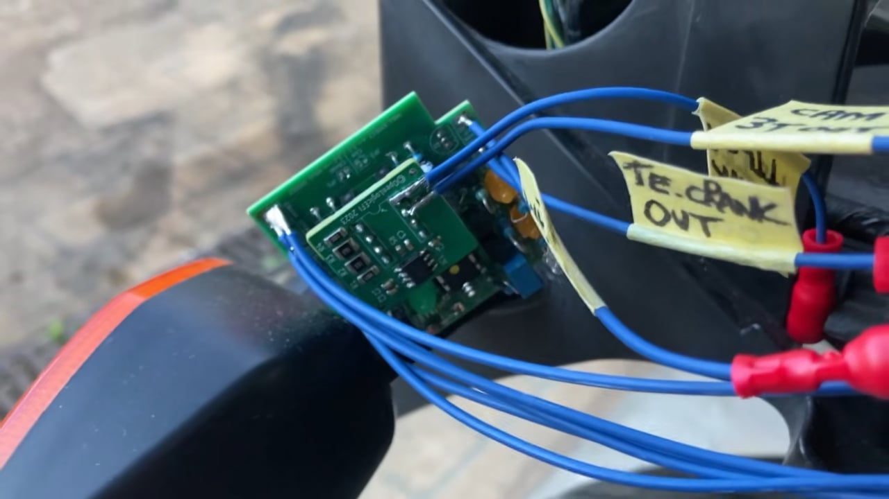

# Tooth Eater Module

Various early 2000's Honda CBR models use a 3-spoke cam trigger wheel. Some examples are the Honda Blackbird CBR1100XX, CBR600 and Honda Aquatrax jet ski. Other models may also use this pattern as well.

 
<table border="1">
<tr>
<td align="center" valign="center">

</img>

The tooth shown in red is the reference tooth that is allowed through to the stand alone ECU. The other teeth are digitally deleted (eaten) by the tooth eater. This reference tooth also happens to align with TDC cylinder #1 & #4.

</table>
</td>
</tr>
 

 While this 3-spoke pattern is designed to work with the OEM Keihin ECU, it will not work with many stand alone ECU's due to its peculiar tooth arrangement. Many stand alone ECU systems available on the market today such as Megasquirt, Speeduino, RusEFI and others will cater for a single tooth pulse from the camshaft without fuss since this is a very standard configuration. In the past, this issue was usually resolved by physically removing two teeth from the original cam trigger wheel (I.e. by grinding or hack-saw), leaving one tooth behind. This allows the stand alone unit but also renders the Keihin unit inoperative since it expects the 3 teeth. If the original Keihin unit was to work again then a new cam trigger wheel would need to be re-installed onto the camshaft. This project aims to allow one to retain the existing Honda wiring harness whilst also eliminating the need to physically grind the two teeth off the camshaft trigger wheel. Therefore making it unnecessary to open the top end and allowing for the original Keihin unit to be reinstalled easily if needed.

You can watch the tooth eater in action working together with the microRusEfi stand alone ECU by clicking on the image below.

 

This 'Tooth Eater' project allows you to run the bike without having to get into the top end and remove the teeth off the exhaust camshaft trigger wheel. Instead, this small PCB and its associated firmware digitally removes 'eats' the two teeth, leaving one behind to be processed by your stand alone unit. With this unit, your stand alone ECU will only see a single cam pulse (home position) instead of three pulses every cam revolution. This should allow the Blackbird and other CBR models with the same cam wheel to be run with many of the available ECU systems on the market.

This Tooth Eater module performs the following tasks: 

<table border="1">

<tr> 
<td width="5%">
<strong>(1)</strong>
</td>
<td width="95%">
Converts the CBR's 3-spoke cam pattern into a single digital pulse making it compatible with other standalone ecu systems on the market.
</td>
</tr>

<tr>
<td width="5%">
<strong>(2)</strong>
</td>
<td width="95%">
Houses an on-board VR conditioner. This unit is a direct plug in module as used on Speeduino boards and it plugs straight into the tooth eater board (as seen in the image above). The Blackbird and other CBR's models require the VR module since they use inductive pickups on both the crank and the cam. The VR module converts the direct signal from the inductive pickups into a 0-5v TTL signal making it compatible with the stand alone ECU. This VR unit is readily available for purchase on the internet as part of the speeduino project.
</td>
</tr>

<tr>
<td width="5%">
<strong>(3)</strong>
</td>
<td width="95%">
On engine startup the tooth eater must 'SYNC' to the reference tooth (shown in red in the above image). it is critical that this tooth is always selected by the firmware on engine startup since the ECU will be also synced to it. The Tooth Eater will inhibit all output until engine SYNC has occurred. Once SYNC has occurred, the tooth eater will 'release' both the CRANK and CAM signals to the stand alone ECU for further processing. This makes for a clean transition ensuring that the ECU receives crisp signals.
</td>
</tr>

</table>

 

<table border="1">
<tr>
<td align="center" valign="center">

</img>

Tooth Eater board with VR module inserted atop.

</table>

 

# General Overview

The tooth eater appears to deal with 'teeth' or pulses, however in reality it is only the rising or falling edges of that pulse that is relevant to the downstream ECU. The ECU deals only with edges and when it receives them it internally fires an interrupt service routine (ISR) that will update the crank and/or cam position in real time. All ECU's work with edges.

The early 2000's CBRs use a 12 tooth crank trigger wheel. The teeth are exactly spaced as the hours on a clock. In one crank revolution the ECU will see 12 pulses (360 deg). Two crank revolutions constitutes one engine cycle in which case 24 crank pulses will have been received by the ECU (720 deg). In one engine cycle exactly one cam pulse will be produced by the tooth eater.

The cam trigger wheel is as shown below. The tooth highlighted in red is the SYNC tooth as mentioned. I also refer to this tooth as the 'First Paired', since it is adjacent to its neighbour tooth that I refer to the 'Second Paired'. The remaining opposite tooth (on its own) I refer to as the 'Isolated' tooth. Once SYNCED, the firmware inhibits the 'Second Paired' and 'Isolated' tooth and only allows the 'First Paired' to pass through. It does this continually as the engine is running, however in most cases the ECU is only interested in the initial startup then manages its own cam sync internally. Once SYNCED, the crank signal is allowed to 'pass-through' to the ECU via the VR conditioner. When the engine is running the crank signal is not processed by the tooth eater, however it is briefly used at engine startup in conjunction with the cam signal to gain SYNC as fast as possible for short cranking times. In the worst case scenario, SYNC should be attained in no more than 2 camshaft revolutions or 4 crank revolutions. Both cam and crank signals are used to gain initial sync.

<table border="1">
<tr>
<td align="center" valign="center">

</img>

The 'First Paired' tooth as shown by the red arrow is the SYNC tooth. The other two teeth are removed by the digital processing.

</table>

 
As the camshaft spins at cranking speed it produces a signal as shown below. This is the raw signal as produced by the inductive pickup and is not processable directly by the ECU.

<table border="1">
<tr>
<td align="center" valign="center">

</img>

Three levels of zoom shown of the raw cam signal directly from the inductive pickup.

</table>

 
Likewise, the raw crank signal appears as follows.

<table border="1">
<tr>
<td align="center" valign="center">

</img>

Raw crank signal directly from the inductive pickup.

</table>

These raw signals are fed into the VR conditioner plug-in module. The TTL output is shown in the image below. Note the three inverted cam pulses shown in the upper half image. This TTL signal is fed into the tooth eater for processing. The lower half image shows the crank signal.

<table border="1">
<tr>
<td align="center" valign="center">

</img>

Crank and cam signals as processed by the VR plug-in module.

</table>

 

Finally, the output produced by the tooth eater module. Both the cam and crank signals are now in an acceptable format for use with a stand alone ECU.
<table border="1">
<tr>
<td align="center" valign="center">

</img>

Tooth Eater processed output. This is fed into the downstream ECU. I.e. 24 crank pulses and 1 cam pulse. This makes for a very standard configuration that most ECU's will support.

</table>

 
Once in Tuner Studio, we configure the ECU for 12T crank and 1T cam. In RusEFI the dialog box is shown below. For Speeduino, 'Dual Wheel' would need to be selected and configured in a similar manner.

<table border="1">
<tr>
<td align="center" valign="center">

</img>

In my case I used RusEFI. The trigger configuration shown was used with the cam and crank signals.

</table>

 
The output we expect from the high speed logger interface in Tuner Studio is shown.
<table border="1">
<tr>
<td align="center" valign="center">

</img>

This is the desired output we want to see. I.e. One cam pulse per two crank revolutions (24 crank pulses).

</table>

# Principles of Operation
Coming next.
